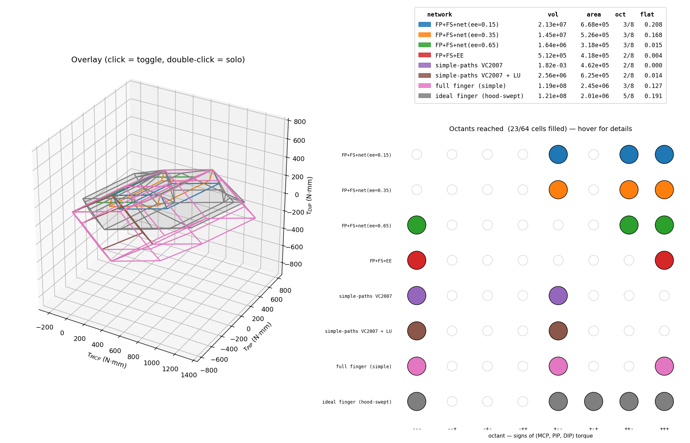
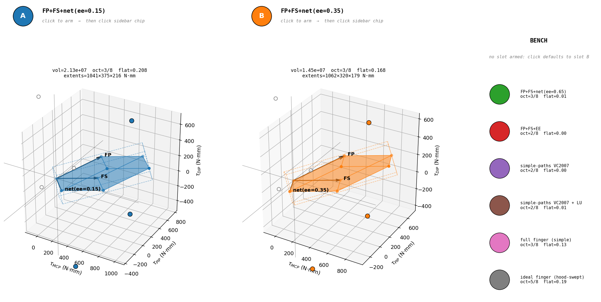

# feasible-torque-set

Interactive Python tool for computing and visualizing the 3D feasible torque
set of a tendon-driven finger in (τ\_MCP, τ\_PIP, τ\_DIP) joint-torque space.
Built to replicate and extend the analysis in Valero-Cuevas et al. 2007,
*"The Tendon Network of the Fingers Performs Anatomical Computation at a
Macroscopic Scale"* (IEEE TBME).



Eight preset finger configurations are computed and compared, ranging from
the paper's "simple tendon paths" critique case to a hood-swept "ideal
finger" that approximates the maximum reachable envelope across all neural
control strategies.



## What it computes

For each tendon network configuration, the tool computes the convex hull of
all reachable joint-torque vectors in 3D space.

- **Fixed-direction networks** (each tendon = constant moment-arm vector):
  the feasible set is the *Minkowski sum* of line segments
  `[0, F_max_i · moment_arm_i]` per tendon — a zonotope whose 2ⁿ vertices
  are the corner activations. Computed exactly via `compute_feasible_set`.
- **Hood-routed networks** (EE + DI tensions split through Winslow's
  rhombus, basis vector *rotates* with input ratio): exact Minkowski summing
  fails because intermediate activations produce torques not on any line
  between corners. Computed by sampling the activation space and taking the
  hull of all sampled torques — `sample_feasible_set` / the "hood-swept"
  approach.

Diagnostics computed per network: volume, surface area, octants reached (out
of 8), principal-axis extents, flatness ratio.

## Key result

The `ideal finger (hood-swept)` model reaches **5 of 8 octants** in
(τ\_MCP, τ\_PIP, τ\_DIP) space. The 3 octants it cannot reach correspond
exactly to the three classical IP-joint deformities:

| Octant | Posture name | Clinical etiology |
|---|---|---|
| `+-+` | swan-neck (model artifact, see below) | volar plate laxity / intrinsic tightness |
| `-+-` | boutonniere | central slip rupture |
| `--+` | mallet finger | terminal slip / FDP avulsion |

The framework's geometric constraints (Minkowski-sum reachability under
non-negative tendon activations) produce the same unreachability set that
biology produces clinically — these postures only appear when the
anatomical coupling that prevents them is *damaged*.

Healthy fingers naturally reach the same 5 octants the model does. Tested
informally by trying each posture with my own hand.

## Honest limitations

The model gets two of the deformity octants right for the right reason but
one of them wrong:

- **Swan-neck (`+-+`) is reachable in the model but shouldn't be.** The
  oblique retinacular ligament (ORL) passively couples PIP extension to
  DIP extension; my hood model treats proximal-slip and terminal-slip
  outputs as independent so the coupling isn't enforced.
- **Hook grip (`-++`) is unreachable in the model but trivially achievable
  in real life.** Missing palmar interossei (PI) as antagonists to the
  dorsal interossei, and the framework only models active torque (no
  passive/relaxed-MCP mode).

Both are honest framework limitations that mirror what VC2007 itself
acknowledges. The structural model is sound; the missing physics is
catalogued for future work.

## Install + run

```bash
# deps: numpy, scipy, matplotlib (Python 3.9+)
pip install --user numpy scipy matplotlib

# all 8 presets, interactive 3D windows + saved PNGs
python3 main.py

# specific subset
python3 main.py ideal full simple_paths

# list available presets
python3 main.py --list

# save PNGs only (no windows)
python3 main.py --no-show
```

## Module layout

| File | Role |
|---|---|
| `tendon_network.py` | `Tendon` and `TendonNetwork` dataclasses — the unit of definition |
| `torque_space.py` | `compute_feasible_set` (fixed-direction, 2ⁿ corner enumeration), `sample_feasible_set` (variable-direction, activation-space sweep), diagnostic metrics, OBB / PCA helpers |
| `visualize.py` | Interactive 3D matplotlib viewers: `plot_overlay` (all hulls nested + octant matrix + hover tooltips), `plot_dual_focus` (paired comparison with swap sidebar), `plot_comparison` (grid), `plot_octant_summary` |
| `experiments.py` | 8 preset finger configurations + the Winslow-rhombus hood routing model + the `ideal_finger_set()` hood-swept envelope |
| `main.py` | CLI entry point |

## Interactive features

- **Overlay viewer**: click any legend row to toggle that hull on/off;
  double-click to solo. Hover any cell of the octant matrix, any row
  label, or any column label for biomechanical descriptions of the
  network or octant.
- **Dual-focus viewer**: two 3D panels showing one hull each, with a
  "bench" sidebar of all other networks. Click the A/B button to arm a
  slot, click a bench chip to swap into it. Tendon arrows in each panel
  are labeled with the muscle name; hover labels for full anatomy
  descriptions.

## Reference

- Valero-Cuevas, F.J., Yi, J.-W., Brown, D., McNamara III, R.V., Paul, C.,
  & Lipson, H. (2007). The Tendon Network of the Fingers Performs
  Anatomical Computation at a Macroscopic Scale. *IEEE Transactions on
  Biomedical Engineering*, 54(6), 1161–1166.
